<!-- Galaxy Profile README Template
     Customize this file with your own info, then rename it to README.md
     in your GitHub profile repo (github.com/YOUR_USERNAME/YOUR_USERNAME).
     The SVG paths below point to assets/generated/ which are auto-generated
     by the GitHub Actions workflow or by running: python -m generator.main -->

  

 

<h2 align="left">Sèdrick Zahn Tsoucas</h2>

**Full-Stack Developer** with experience in designing, building, and maintaining reliable software systems.
Focused on clean architecture, maintainability, and practical problem-solving.

Strong interest in backend development, system design, and understanding core engineering principles beyond frameworks.

 

  

 

<strong>More about me</strong>

 

Building tools that make developers' lives easier.
Passionate about distributed systems, developer experience, and the open-source ecosystem.

**Currently at** Stellar Labs — San Francisco, CA

 

  
  

